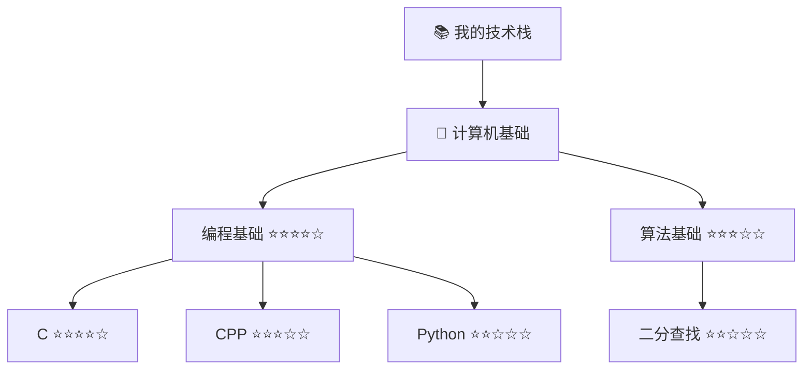

# 我的技能树

```mermaid
flowchart TD
    Root[📚 我的技术栈] --> Work[🧱 计算机基础]
    
    Work --> LanguageBasic[编程基础 ⭐⭐⭐⭐☆]
    Work --> AlgorithmBasic[算法基础 ⭐⭐⭐☆☆]
    
    LanguageBasic --> Lang_C[C ⭐⭐⭐⭐☆]
    LanguageBasic --> Lang_CPP[CPP ⭐⭐⭐☆☆]
    LanguageBasic --> Lang_Python[Python ⭐⭐☆☆☆]
    
    AlgorithmBasic --> Algo_BinarySearch[二分查找 ⭐⭐☆☆☆]
    
    %% 点击后在新标签页预览 Summary.md
    click Algo_BinarySearch "vscode://file/Users/yangyang/workspace/skilltree/skill-tree/basic/work/AlgorithmBasic/Algo_BinarySearch/Summary.md" "预览二分查找题解"
```