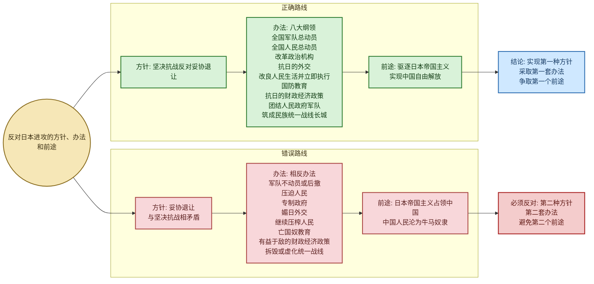

# 反对日本进攻的方针、办法和前途

```mermaid
flowchart LR
    A((反对日本进攻的方针、办法和前途))

    subgraph L[正确路线]
        L1[方针: 坚决抗战反对妥协退让]
        L2[办法: 八大纲领<br/>全国军队总动员<br/>全国人民总动员<br/>改革政治机构<br/>抗日的外交<br/>改良人民生活并立即执行<br/>国防教育<br/>抗日的财政经济政策<br/>团结人民政府军队<br/>筑成民族统一战线长城]
        L3[前途: 驱逐日本帝国主义<br/>实现中国自由解放]
        L1 --> L2 --> L3
    end

    subgraph R[错误路线]
        R1[方针: 妥协退让<br/>与坚决抗战相矛盾]
        R2[办法: 相反办法<br/>军队不动员或后撤<br/>压迫人民<br/>专制政府<br/>媚日外交<br/>继续压榨人民<br/>亡国奴教育<br/>有益于敌的财政经济政策<br/>拆毁或虚化统一战线]
        R3[前途: 日本帝国主义占领中国<br/>中国人民沦为牛马奴隶]
        R1 --> R2 --> R3
    end

    A --> L1
    A --> R1
    L3 --> C[结论: 实现第一种方针<br/>采取第一套办法<br/>争取第一个前途]
    R3 --> D[必须反对: 第二种方针<br/>第二套办法<br/>避免第二个前途]

    classDef root fill:#f6e7b7,stroke:#8a6d1f,stroke-width:2px,color:#3b2f12;
    classDef right fill:#d9f2d9,stroke:#2f7d32,stroke-width:2px,color:#123d14;
    classDef wrong fill:#f8d7da,stroke:#a94442,stroke-width:2px,color:#5a1f1e;
    classDef goodend fill:#cfe8ff,stroke:#2b6cb0,stroke-width:2px,color:#163a63;
    classDef badend fill:#f4cccc,stroke:#a61c1c,stroke-width:2px,color:#611a15;

    class A root;
    class L1,L2,L3 right;
    class R1,R2,R3 wrong;
    class C goodend;
    class D badend;
```