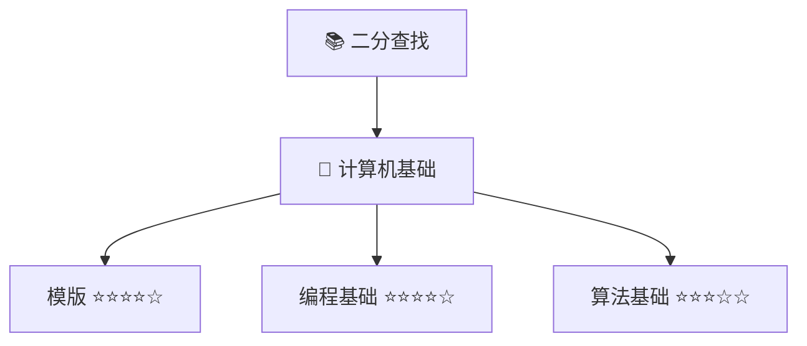

# 我的技能树

```mermaid
flowchart TD
    Root[📚 二分查找] --> BinarySearch[🧱 计算机基础]
    BinarySearch --> Template[模版 ⭐⭐⭐⭐☆]
    
    BinarySearch --> LanguageBasic[编程基础 ⭐⭐⭐⭐☆]
    BinarySearch --> AlgorithmBasic[算法基础 ⭐⭐⭐☆☆]
    
    %% 点击后在新标签页预览 Summary.md
    click Algo_BinarySearch "vscode://file/Users/yangyang/workspace/skilltree/skill-tree/basic/work/AlgorithmBasic/Algo_BinarySearch/Summary.md" "预览二分查找题解"
```