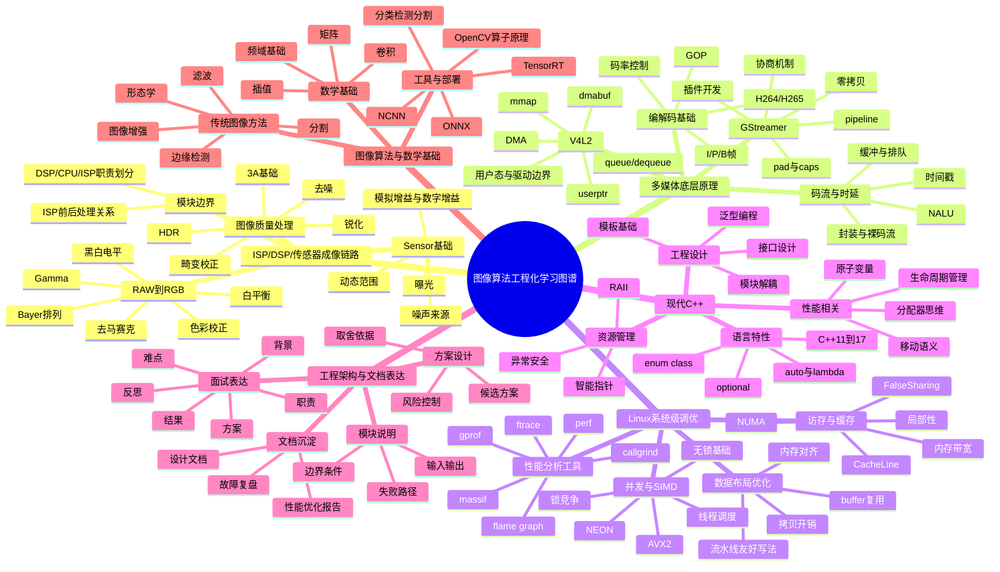
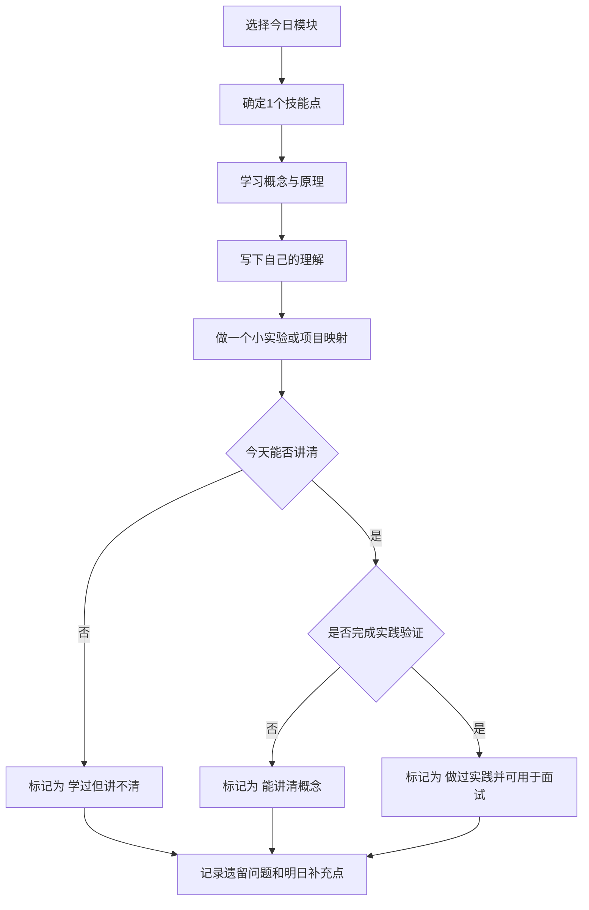

# 图像算法工程化学习打卡表

本文档用于按模块梳理必会技能点、常见面试考点、实践建议和每日打卡记录，便于持续查缺补漏。

## Mermaid 总览图



## Mermaid 打卡流程图



## 使用说明

建议每天只做四件事：

1. 学一个小主题。
2. 写一段自己的理解。
3. 做一个小实验或项目映射。
4. 标记今天的完成状态和遗留问题。

建议状态标记：

- [ ] 未开始
- [~] 学过但讲不清
- [x] 能讲清概念
- [!] 做过实践并可用于面试

建议优先级：

1. ISP/DSP/传感器成像链路
2. 多媒体底层原理
3. Linux 系统级调优
4. 现代 C++
5. 工程架构与文档表达
6. 图像算法与数学基础

## 一、ISP / DSP / 传感器成像链路明细

### 必会基础知识补充

- Sensor 工作机理
	- 必须知道传感器本质上是在曝光时间内累积光电信号，最终输出的是带噪声的原始电信号数字化结果。
	- 必须区分模拟增益和数字增益：模拟增益在前端放大信号，数字增益在后端放大数值，两者都会提升亮度，但都会放大噪声。
	- 必须理解动态范围决定高亮和暗部能否同时保留细节。
- RAW 数据本质
	- 必须知道 RAW 不是可直接显示的彩色图，而是传感器采样后的原始马赛克数据。
	- 必须理解 Bayer 排列让每个像素点只采样一个颜色分量，因此必须经过去马赛克重建完整颜色。
	- 必须知道 bit depth 决定可表达灰度层级，黑白电平决定有效信号范围。
- ISP 基本处理顺序
	- 必须理解前处理通常先做黑电平、坏点、去马赛克，再做白平衡、色彩校正、Gamma、降噪、锐化等。
	- 必须知道顺序不能随意交换，因为前一步输出质量直接影响后一步输入分布。
- 图像质量核心指标
	- 必须知道亮度、对比度、噪声、清晰度、色偏、畸变是最常见的质量维度。
	- 必须理解降噪和锐化往往互相制约，HDR 会提升动态范围但可能带来鬼影和不自然感。
- 3A 基础
	- AE 负责曝光控制，AWB 负责颜色中性，AF 负责清晰对焦。
	- 面试时至少能说清三者分别控制什么，不要求一开始深入到控制算法细节。
- ISP / DSP / CPU 职责边界
	- ISP 更适合固定功能、低时延、靠近采集端的处理。
	- DSP 更适合规则明确、计算量大、实时性较强的专用计算。
	- CPU 更适合复杂控制逻辑、灵活算法、调试和产品化迭代。
	- 必须理解模块放在哪里通常取决于实时性、带宽、功耗、开发复杂度和可维护性。

- Sensor 基础
	- 必会：曝光、模拟增益、数字增益、动态范围、噪声来源。
	- 面试常问：曝光和增益区别、为什么高增益会放大噪声。
	- 建议实践：画出 Sensor 到 RAW 的链路图。
- RAW 到 RGB
	- 必会：Bayer 排列、bit depth、黑白电平、去马赛克。
	- 面试常问：RAW 为什么不能直接显示、去马赛克为什么重要。
	- 建议实践：整理一页 RAW 到 RGB 关键步骤笔记。
- 图像质量处理
	- 必会：白平衡、色彩校正、Gamma、去噪、锐化、畸变校正、HDR、3A。
	- 面试常问：白平衡和色彩校正区别、降噪和锐化如何取舍、HDR 的副作用。
	- 建议实践：对每个模块写一句输入、处理、输出说明。
- 模块边界
	- 必会：ISP 前后处理关系、DSP/CPU/ISP 职责划分。
	- 面试常问：为什么某个算法放后处理而不是前处理，为什么放 CPU 而不是 ISP。
	- 建议实践：画出 Sensor-ISP-DSP-CPU-Display 分工图。

## 二、多媒体底层原理明细

### 必会基础知识补充

- 视频编码最小认知
	- 必须知道视频压缩依赖时域冗余和空域冗余压缩，不是简单逐帧存图。
	- 必须理解 I 帧独立、P 帧参考前帧、B 帧双向参考，这直接影响码率和延迟。
- 码流与封装的区别
	- 必须区分裸码流和封装格式，前者是压缩数据本体，后者是带时间戳、索引和容器结构的文件格式。
	- 至少知道 H.264/H.265 是编码标准，MP4/MOV 是封装容器。
- 时延与缓存机制
	- 必须知道时延不仅来自编码计算，还来自缓冲、排队、同步和显示等待。
	- 必须理解低延迟链路通常要减少 B 帧、减小缓冲、优化时间戳和队列长度。
- GStreamer 基础认知
	- 必须知道 pipeline 是由多个 element 串起来的数据流图。
	- 必须理解 caps 是格式能力描述，协商失败往往意味着上下游格式不兼容。
	- 必须知道插件机制决定它适合搭建可插拔媒体链路。
- V4L2 基础认知
	- 必须知道 V4L2 是 Linux 常见视频采集接口，重点是 buffer 申请、入队、出队和流控制。
	- 必须区分 read、mmap、userptr、dmabuf 的用途和性能差异。
- 零拷贝与 DMA
	- 必须理解图像和视频数据很大，多一次拷贝就可能带来明显的 CPU 和带宽开销。
	- 必须知道 DMA 是降低 CPU 搬运成本的重要手段，但也会引出缓存一致性问题。

- 编解码基础
	- 必会：H.264/H.265、I/P/B 帧、GOP、参考帧、码率控制。
	- 面试常问：I/P/B 帧区别、为什么 B 帧影响时延。
	- 建议实践：写一页编码基础卡片。
- 码流与时延
	- 必会：NALU、封装与裸码流、缓冲、时间戳、排队时延。
	- 面试常问：H.264 码流和 MP4 区别、为什么链路会越跑越延迟。
	- 建议实践：画一条简化的视频处理链路。
- GStreamer
	- 必会：pipeline、pad、caps、协商机制、插件开发、零拷贝。
	- 面试常问：caps negotiation 在做什么、pipeline 为什么会卡住。
	- 建议实践：画一个最小 pipeline 图。
- V4L2
	- 必会：queue/dequeue、mmap、userptr、dmabuf、DMA、驱动与用户态边界。
	- 面试常问：mmap 和 dmabuf 的区别、如何判断问题在驱动还是用户态。
	- 建议实践：做一个 buffer 模式对比表。

## 三、Linux 系统级调优明细

### 必会基础知识补充

- 性能问题的第一原则
	- 必须先测量再优化，不能凭感觉改代码。
	- 必须能把问题拆成 CPU 计算、访存、锁竞争、调度、IO 或数据搬运几个方向。
- Cache 与局部性
	- 必须知道 CPU 处理速度远快于内存访问速度，cache 是性能关键。
	- 必须理解顺序访问、数据分块、减少跨 cache line 访问通常能带来收益。
- NUMA 与内存带宽
	- 即使当前项目单机为主，也要知道跨节点访问和内存带宽瓶颈会限制扩展性。
	- 面试时至少能说清 NUMA 是非一致内存访问架构，不同 CPU 核心访问本地和远端内存成本不同。
- 多线程与同步
	- 必须知道线程不是越多越好，线程切换、锁竞争、任务粒度不合理都可能拖慢程序。
	- 必须理解 mutex 适合保护临界区，atomic 适合简单共享状态。
- SIMD 本质
	- 必须理解 SIMD 是一次指令处理多个数据，适用于规则一致、数据连续的批量计算。
	- 必须知道向量化常受限于数据对齐、分支过多、访存不连续。
- 常见工具边界
	- perf 适合看 CPU 热点和事件统计。
	- ftrace 更偏系统级时序和调度。
	- callgrind 更适合调用关系分析。
	- massif 更适合堆内存增长分析。

- 访存与缓存
	- 必会：cache line、局部性、NUMA、内存带宽、false sharing。
	- 面试常问：为什么图像处理容易被访存拖慢，多线程为什么会越加越慢。
	- 建议实践：做顺序访问和随机访问的简单对比实验。
- 性能分析工具
	- 必会：perf、ftrace、flame graph、gprof、callgrind、massif。
	- 面试常问：如何定位热点、不同工具的使用边界。
	- 建议实践：在一个小 demo 上做一次热点分析。
- 并发与 SIMD
	- 必会：线程调度、锁竞争、无锁基础、NEON、AVX2。
	- 面试常问：什么样的代码适合向量化，为什么并行化不一定总有收益。
	- 建议实践：写一个串行版和并行版的小算子。
- 数据布局优化
	- 必会：内存对齐、拷贝开销、buffer 复用、流水线友好写法。
	- 面试常问：为什么减少一次拷贝会有明显收益。
	- 建议实践：梳理现有项目中的中间 buffer 使用点。

## 四、现代 C++ 明细

### 必会基础知识补充

- 现代 C++ 的目标
	- 必须知道现代 C++ 不是为了语法更复杂，而是为了更安全地管理资源、更清晰地表达所有权、更高效地组织代码。
- RAII 和资源管理
	- 必须理解资源不仅是内存，也包括文件句柄、锁、socket、线程句柄。
	- 必须知道 RAII 的关键价值是异常和早返回路径下也能正确释放资源。
- 智能指针
	- unique_ptr 表示独占所有权。
	- shared_ptr 表示共享所有权。
	- weak_ptr 用来打破 shared_ptr 循环引用。
	- 面试时至少要能说清这三者的选型原则。
- 移动语义
	- 必须知道拷贝会复制资源，移动是转移资源控制权。
	- 必须理解 move 本身不移动数据，而是把对象转换为可移动语义。
- 并发标准库
	- 必须熟悉 thread、mutex、condition_variable、atomic 的基本用途。
	- 必须能说清锁保护的是一段逻辑，而 atomic 更多是保护一个共享变量。
- 模板与接口设计
	- 必须知道模板的价值在于复用类型无关逻辑，而不是炫技。
	- 必须理解好的接口设计要清楚输入输出、错误处理和依赖边界。
- 生命周期与性能
	- 必须理解临时对象、频繁堆分配、对象复制都会影响高性能程序。
	- 面试时最好能结合自己的项目讲出一个对象生命周期优化案例。

- 语言特性
	- 必会：C++11 到 C++17 常用特性、auto、lambda、enum class、optional。
	- 面试常问：现代 C++ 比旧写法解决了什么问题。
	- 建议实践：整理一页常用特性速记卡。
- 资源管理
	- 必会：RAII、智能指针、异常安全。
	- 面试常问：shared_ptr 为什么会循环引用，RAII 为什么重要。
	- 建议实践：用 RAII 包装一个资源对象。
- 性能相关
	- 必会：移动语义、原子变量、生命周期管理、分配器思维。
	- 面试常问：移动语义解决了什么问题，atomic 是否一定比 mutex 快。
	- 建议实践：写一个支持 move 的小类。
- 工程设计
	- 必会：模板基础、泛型编程、接口设计、模块解耦。
	- 面试常问：如何设计可维护的图像处理模块接口。
	- 建议实践：重构一次自己的 demo 模块边界。

## 五、工程架构与文档表达明细

### 必会基础知识补充

- 模块化表达能力
	- 必须能先说清模块做什么、输入是什么、输出是什么、依赖谁、失败时怎么处理。
	- 这是中高级岗位区分度很高的一项能力。
- 方案设计基本框架
	- 必须知道一个可接受的技术方案至少包括背景、问题、约束、候选方案、选型理由、风险和验证方式。
	- 面试里不要只说“我这么做了”，要说“为什么这样做更合理”。
- 性能优化表达框架
	- 必须能按现象、测量、热点、改动、收益、回归验证来讲。
	- 不能只报结果数字，否则面试官会怀疑结果真实性或个人贡献度。
- 故障复盘能力
	- 必须知道完整闭环至少包括现象、复现条件、排查路径、关键证据、根因、修复和验证。
	- 这是证明 ownership 和排障能力的关键材料。
- 文档沉淀能力
	- 必须会写简化版设计文档、优化报告、问题复盘文档。
	- 文档不是形式，而是把零散经验沉淀成可复用方法论的工具。

- 模块说明
	- 必会：输入输出、边界条件、失败路径。
	- 面试常问：你负责模块的输入输出和边界是什么。
	- 建议实践：给一个项目模块写输入输出说明。
- 方案设计
	- 必会：候选方案、取舍依据、风险控制。
	- 面试常问：为什么选择当前方案而不是另一个。
	- 建议实践：给一个模块写三种方案对比。
- 文档沉淀
	- 必会：设计文档、性能优化报告、故障复盘。
	- 面试常问：如何证明优化结果可信，如何证明找到的是根因。
	- 建议实践：写一篇简化版优化报告或复盘。
- 面试表达
	- 必会：背景、难点、职责、方案、结果、反思。
	- 面试常问：如何把参与过的项目讲出 ownership。
	- 建议实践：每个项目各写 3 分钟和 8 分钟版本。

## 六、图像算法与数学基础明细

### 必会基础知识补充

- 数学不求过深，但要够用
	- 必须掌握矩阵、卷积、插值、基础频域概念，因为这些几乎贯穿所有传统图像处理问题。
	- 不要求一开始推导复杂公式，但必须知道这些工具解决什么问题。
- 卷积与滤波
	- 必须知道卷积核是在局部邻域内做加权计算，因此能实现平滑、锐化、边缘增强等功能。
	- 必须理解不同卷积核代表不同处理目标。
- 插值与几何变换
	- 必须知道 resize、旋转、矫正背后都离不开插值。
	- 必须理解最近邻快但锯齿明显，双线性更平滑，双三次质量更高但更慢。
- 形态学与分割
	- 必须知道腐蚀、膨胀、开运算、闭运算适合处理结构性目标和噪点。
	- 必须理解阈值分割和边缘检测是最常见的传统分割入口。
- OpenCV 与原理对应
	- 必须避免只会调库不会解释。
	- 至少要知道常用算子对应的原理和大致计算代价。
- 模型工程化补充
	- 必须知道分类、检测、分割三类任务的区别。
	- 必须知道模型部署要关注输入输出格式、前后处理一致性、精度和时延权衡。

- 数学基础
	- 必会：矩阵、卷积、插值、频域基础。
	- 面试常问：卷积为什么能做滤波和边缘检测，为什么插值影响画质和耗时。
	- 建议实践：手写一个 3x3 卷积示例。
- 传统图像方法
	- 必会：滤波、形态学、图像增强、边缘检测、分割。
	- 面试常问：中值滤波适合什么噪声，边缘检测算子区别是什么。
	- 建议实践：用 OpenCV 对比几种滤波和边缘方法。
- 工具与部署
	- 必会：OpenCV 算子原理、分类/检测/分割区别、ONNX、TensorRT、NCNN。
	- 面试常问：模型工程化和模型训练的区别。
	- 建议实践：跑一个轻量 ONNX 推理 demo。

## 七、每日打卡模板

复制下面模板，每天新增一条记录：

```md
### 日期：2026-03-18

- 今日模块：
- 今日技能点：
- 学习输入：
- 我自己的理解：
- 实践动作：
- 遇到的问题：
- 今天状态：[ ] / [~] / [x] / [!]
- 明日补充点：
```

## 八、每周复盘模板

```md
## 第 X 周复盘

- 本周完成模块：
- 本周能讲清的知识点：
- 本周还讲不清的点：
- 做过的实验或实践：
- 可写进简历或面试的内容：
- 下周优先补齐项：
```

## 九、面试前自检清单

- [ ] 我能画出 Sensor -> RAW -> ISP -> DSP / CPU -> Display 的链路。
- [ ] 我能解释曝光、增益、白平衡、Gamma、去噪、锐化的基本作用。
- [ ] 我能解释 GStreamer、V4L2、DMA、mmap、零拷贝之间的关系。
- [ ] 我能讲清一次性能优化如何定位、如何验证、如何量化结果。
- [ ] 我能用现代 C++ 解释资源管理、移动语义和并发基础。
- [ ] 我能把一个项目讲成完整闭环：背景、问题、方案、验证、收益。
- [ ] 我能解释卷积、插值、滤波、形态学这些图像基础方法。
- [ ] 我能说明自己当前短板和下一步补强方向。