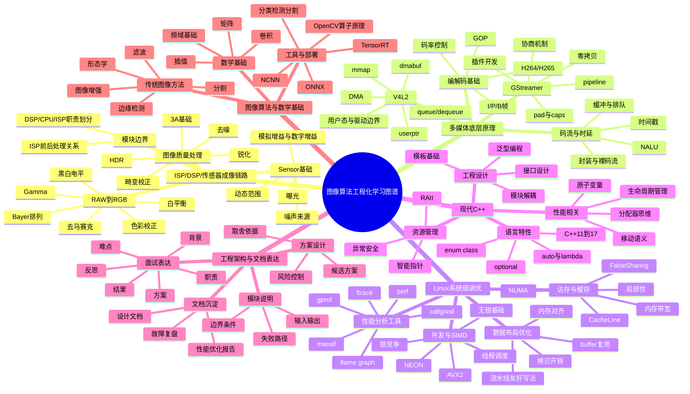
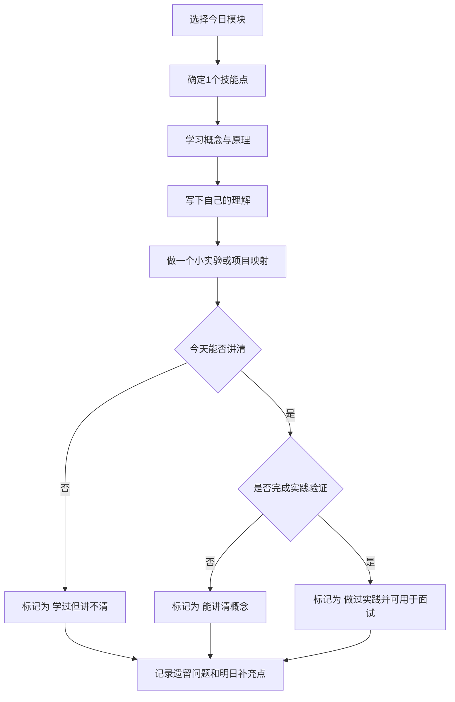

# 图像算法工程化学习打卡表

本文档用于按模块梳理必会技能点、常见面试考点、实践建议和每日打卡记录，便于持续查缺补漏。

## Mermaid 总览图




## Mermaid 打卡流程图




## 使用说明

建议每天只做四件事：

1. 学一个小主题。
2. 写一段自己的理解。
3. 做一个小实验或项目映射。
4. 标记今天的完成状态和遗留问题。

建议状态标记：

- 未开始
- [~] 学过但讲不清
- 能讲清概念
- [!] 做过实践并可用于面试

建议优先级：

1. ISP/DSP/传感器成像链路
2. 多媒体底层原理
3. Linux 系统级调优
4. 现代 C++
5. 工程架构与文档表达
6. 图像算法与数学基础

## 一、ISP / DSP / 传感器成像链路明细

### 必会基础知识补充

- Sensor 工作机理
  - 必须知道传感器本质上是在曝光时间内累积光电信号，最终输出的是带噪声的原始电信号数字化结果。
  - 必须区分模拟增益和数字增益：模拟增益在前端放大信号，数字增益在后端放大数值，两者都会提升亮度，但都会放大噪声。
  - 必须理解动态范围决定高亮和暗部能否同时保留细节。
- RAW 数据本质
  - 必须知道 RAW 不是可直接显示的彩色图，而是传感器采样后的原始马赛克数据。
  - 必须理解 Bayer 排列让每个像素点只采样一个颜色分量，因此必须经过去马赛克重建完整颜色。
  - 必须知道 bit depth 决定可表达灰度层级，黑白电平决定有效信号范围。
- ISP 基本处理顺序
  - 必须理解前处理通常先做黑电平、坏点、去马赛克，再做白平衡、色彩校正、Gamma、降噪、锐化等。
  - 必须知道顺序不能随意交换，因为前一步输出质量直接影响后一步输入分布。
- 图像质量核心指标
  - 必须知道亮度、对比度、噪声、清晰度、色偏、畸变是最常见的质量维度。
  - 必须理解降噪和锐化往往互相制约，HDR 会提升动态范围但可能带来鬼影和不自然感。
- 3A 基础
  - AE 负责曝光控制，AWB 负责颜色中性，AF 负责清晰对焦。
  - 面试时至少能说清三者分别控制什么，不要求一开始深入到控制算法细节。
- ISP / DSP / CPU 职责边界
  - ISP 更适合固定功能、低时延、靠近采集端的处理。
  - DSP 更适合规则明确、计算量大、实时性较强的专用计算。
  - CPU 更适合复杂控制逻辑、灵活算法、调试和产品化迭代。
  - 必须理解模块放在哪里通常取决于实时性、带宽、功耗、开发复杂度和可维护性。
- Sensor 基础
  - 必会：曝光、模拟增益、数字增益、动态范围、噪声来源。
  - 面试常问：曝光和增益区别、为什么高增益会放大噪声。
  - 建议实践：画出 Sensor 到 RAW 的链路图。
- RAW 到 RGB
  - 必会：Bayer 排列、bit depth、黑白电平、去马赛克。
  - 面试常问：RAW 为什么不能直接显示、去马赛克为什么重要。
  - 建议实践：整理一页 RAW 到 RGB 关键步骤笔记。
- 图像质量处理
  - 必会：白平衡、色彩校正、Gamma、去噪、锐化、畸变校正、HDR、3A。
  - 面试常问：白平衡和色彩校正区别、降噪和锐化如何取舍、HDR 的副作用。
  - 建议实践：对每个模块写一句输入、处理、输出说明。
- 模块边界
  - 必会：ISP 前后处理关系、DSP/CPU/ISP 职责划分。
  - 面试常问：为什么某个算法放后处理而不是前处理，为什么放 CPU 而不是 ISP。
  - 建议实践：画出 Sensor-ISP-DSP-CPU-Display 分工图。

## 二、多媒体底层原理明细

### 必会基础知识补充

- 视频编码最小认知
  - 必须知道视频压缩依赖时域冗余和空域冗余压缩，不是简单逐帧存图。
  - 必须理解 I 帧独立、P 帧参考前帧、B 帧双向参考，这直接影响码率和延迟。
- 码流与封装的区别
  - 必须区分裸码流和封装格式，前者是压缩数据本体，后者是带时间戳、索引和容器结构的文件格式。
  - 至少知道 H.264/H.265 是编码标准，MP4/MOV 是封装容器。
- 时延与缓存机制
  - 必须知道时延不仅来自编码计算，还来自缓冲、排队、同步和显示等待。
  - 必须理解低延迟链路通常要减少 B 帧、减小缓冲、优化时间戳和队列长度。
- GStreamer 基础认知
  - 必须知道 pipeline 是由多个 element 串起来的数据流图。
  - 必须理解 caps 是格式能力描述，协商失败往往意味着上下游格式不兼容。
  - 必须知道插件机制决定它适合搭建可插拔媒体链路。
- V4L2 基础认知
  - 必须知道 V4L2 是 Linux 常见视频采集接口，重点是 buffer 申请、入队、出队和流控制。
  - 必须区分 read、mmap、userptr、dmabuf 的用途和性能差异。
- 零拷贝与 DMA
  - 必须理解图像和视频数据很大，多一次拷贝就可能带来明显的 CPU 和带宽开销。
  - 必须知道 DMA 是降低 CPU 搬运成本的重要手段，但也会引出缓存一致性问题。
- 编解码基础
  - 必会：H.264/H.265、I/P/B 帧、GOP、参考帧、码率控制。
  - 面试常问：I/P/B 帧区别、为什么 B 帧影响时延。
  - 建议实践：写一页编码基础卡片。
- 码流与时延
  - 必会：NALU、封装与裸码流、缓冲、时间戳、排队时延。
  - 面试常问：H.264 码流和 MP4 区别、为什么链路会越跑越延迟。
  - 建议实践：画一条简化的视频处理链路。
- GStreamer
  - 必会：pipeline、pad、caps、协商机制、插件开发、零拷贝。
  - 面试常问：caps negotiation 在做什么、pipeline 为什么会卡住。
  - 建议实践：画一个最小 pipeline 图。
- V4L2
  - 必会：queue/dequeue、mmap、userptr、dmabuf、DMA、驱动与用户态边界。
  - 面试常问：mmap 和 dmabuf 的区别、如何判断问题在驱动还是用户态。
  - 建议实践：做一个 buffer 模式对比表。

## 三、Linux 系统级调优明细

### 必会基础知识补充

- 性能问题的第一原则
  - 必须先测量再优化，不能凭感觉改代码。
  - 必须能把问题拆成 CPU 计算、访存、锁竞争、调度、IO 或数据搬运几个方向。
- Cache 与局部性
  - 必须知道 CPU 处理速度远快于内存访问速度，cache 是性能关键。
  - 必须理解顺序访问、数据分块、减少跨 cache line 访问通常能带来收益。
- NUMA 与内存带宽
  - 即使当前项目单机为主，也要知道跨节点访问和内存带宽瓶颈会限制扩展性。
  - 面试时至少能说清 NUMA 是非一致内存访问架构，不同 CPU 核心访问本地和远端内存成本不同。
- 多线程与同步
  - 必须知道线程不是越多越好，线程切换、锁竞争、任务粒度不合理都可能拖慢程序。
  - 必须理解 mutex 适合保护临界区，atomic 适合简单共享状态。
- SIMD 本质
  - 必须理解 SIMD 是一次指令处理多个数据，适用于规则一致、数据连续的批量计算。
  - 必须知道向量化常受限于数据对齐、分支过多、访存不连续。
- 常见工具边界
  - perf 适合看 CPU 热点和事件统计。
  - ftrace 更偏系统级时序和调度。
  - callgrind 更适合调用关系分析。
  - massif 更适合堆内存增长分析。
- 访存与缓存
  - 必会：cache line、局部性、NUMA、内存带宽、false sharing。
  - 面试常问：为什么图像处理容易被访存拖慢，多线程为什么会越加越慢。
  - 建议实践：做顺序访问和随机访问的简单对比实验。
- 性能分析工具
  - 必会：perf、ftrace、flame graph、gprof、callgrind、massif。
  - 面试常问：如何定位热点、不同工具的使用边界。
  - 建议实践：在一个小 demo 上做一次热点分析。
- 并发与 SIMD
  - 必会：线程调度、锁竞争、无锁基础、NEON、AVX2。
  - 面试常问：什么样的代码适合向量化，为什么并行化不一定总有收益。
  - 建议实践：写一个串行版和并行版的小算子。
- 数据布局优化
  - 必会：内存对齐、拷贝开销、buffer 复用、流水线友好写法。
  - 面试常问：为什么减少一次拷贝会有明显收益。
  - 建议实践：梳理现有项目中的中间 buffer 使用点。

## 四、现代 C++ 明细

### 必会基础知识补充

- 现代 C++ 的目标
  - 必须知道现代 C++ 不是为了语法更复杂，而是为了更安全地管理资源、更清晰地表达所有权、更高效地组织代码。
- RAII 和资源管理
  - 必须理解资源不仅是内存，也包括文件句柄、锁、socket、线程句柄。
  - 必须知道 RAII 的关键价值是异常和早返回路径下也能正确释放资源。
- 智能指针
  - unique_ptr 表示独占所有权。
  - shared_ptr 表示共享所有权。
  - weak_ptr 用来打破 shared_ptr 循环引用。
  - 面试时至少要能说清这三者的选型原则。
- 移动语义
  - 必须知道拷贝会复制资源，移动是转移资源控制权。
  - 必须理解 move 本身不移动数据，而是把对象转换为可移动语义。
- 并发标准库
  - 必须熟悉 thread、mutex、condition_variable、atomic 的基本用途。
  - 必须能说清锁保护的是一段逻辑，而 atomic 更多是保护一个共享变量。
- 模板与接口设计
  - 必须知道模板的价值在于复用类型无关逻辑，而不是炫技。
  - 必须理解好的接口设计要清楚输入输出、错误处理和依赖边界。
- 生命周期与性能
  - 必须理解临时对象、频繁堆分配、对象复制都会影响高性能程序。
  - 面试时最好能结合自己的项目讲出一个对象生命周期优化案例。
- 语言特性
  - 必会：C++11 到 C++17 常用特性、auto、lambda、enum class、optional。
  - 面试常问：现代 C++ 比旧写法解决了什么问题。
  - 建议实践：整理一页常用特性速记卡。
- 资源管理
  - 必会：RAII、智能指针、异常安全。
  - 面试常问：shared_ptr 为什么会循环引用，RAII 为什么重要。
  - 建议实践：用 RAII 包装一个资源对象。
- 性能相关
  - 必会：移动语义、原子变量、生命周期管理、分配器思维。
  - 面试常问：移动语义解决了什么问题，atomic 是否一定比 mutex 快。
  - 建议实践：写一个支持 move 的小类。
- 工程设计
  - 必会：模板基础、泛型编程、接口设计、模块解耦。
  - 面试常问：如何设计可维护的图像处理模块接口。
  - 建议实践：重构一次自己的 demo 模块边界。

## 五、工程架构与文档表达明细

### 必会基础知识补充

- 模块化表达能力
  - 必须能先说清模块做什么、输入是什么、输出是什么、依赖谁、失败时怎么处理。
  - 这是中高级岗位区分度很高的一项能力。
- 方案设计基本框架
  - 必须知道一个可接受的技术方案至少包括背景、问题、约束、候选方案、选型理由、风险和验证方式。
  - 面试里不要只说“我这么做了”，要说“为什么这样做更合理”。
- 性能优化表达框架
  - 必须能按现象、测量、热点、改动、收益、回归验证来讲。
  - 不能只报结果数字，否则面试官会怀疑结果真实性或个人贡献度。
- 故障复盘能力
  - 必须知道完整闭环至少包括现象、复现条件、排查路径、关键证据、根因、修复和验证。
  - 这是证明 ownership 和排障能力的关键材料。
- 文档沉淀能力
  - 必须会写简化版设计文档、优化报告、问题复盘文档。
  - 文档不是形式，而是把零散经验沉淀成可复用方法论的工具。
- 模块说明
  - 必会：输入输出、边界条件、失败路径。
  - 面试常问：你负责模块的输入输出和边界是什么。
  - 建议实践：给一个项目模块写输入输出说明。
- 方案设计
  - 必会：候选方案、取舍依据、风险控制。
  - 面试常问：为什么选择当前方案而不是另一个。
  - 建议实践：给一个模块写三种方案对比。
- 文档沉淀
  - 必会：设计文档、性能优化报告、故障复盘。
  - 面试常问：如何证明优化结果可信，如何证明找到的是根因。
  - 建议实践：写一篇简化版优化报告或复盘。
- 面试表达
  - 必会：背景、难点、职责、方案、结果、反思。
  - 面试常问：如何把参与过的项目讲出 ownership。
  - 建议实践：每个项目各写 3 分钟和 8 分钟版本。

## 六、图像算法与数学基础明细

### 必会基础知识补充

- 数学不求过深，但要够用
  - 必须掌握矩阵、卷积、插值、基础频域概念，因为这些几乎贯穿所有传统图像处理问题。
  - 不要求一开始推导复杂公式，但必须知道这些工具解决什么问题。
- 卷积与滤波
  - 必须知道卷积核是在局部邻域内做加权计算，因此能实现平滑、锐化、边缘增强等功能。
  - 必须理解不同卷积核代表不同处理目标。
- 插值与几何变换
  - 必须知道 resize、旋转、矫正背后都离不开插值。
  - 必须理解最近邻快但锯齿明显，双线性更平滑，双三次质量更高但更慢。
- 形态学与分割
  - 必须知道腐蚀、膨胀、开运算、闭运算适合处理结构性目标和噪点。
  - 必须理解阈值分割和边缘检测是最常见的传统分割入口。
- OpenCV 与原理对应
  - 必须避免只会调库不会解释。
  - 至少要知道常用算子对应的原理和大致计算代价。
- 模型工程化补充
  - 必须知道分类、检测、分割三类任务的区别。
  - 必须知道模型部署要关注输入输出格式、前后处理一致性、精度和时延权衡。
- 数学基础
  - 必会：矩阵、卷积、插值、频域基础。
  - 面试常问：卷积为什么能做滤波和边缘检测，为什么插值影响画质和耗时。
  - 建议实践：手写一个 3x3 卷积示例。
- 传统图像方法
  - 必会：滤波、形态学、图像增强、边缘检测、分割。
  - 面试常问：中值滤波适合什么噪声，边缘检测算子区别是什么。
  - 建议实践：用 OpenCV 对比几种滤波和边缘方法。
- 工具与部署
  - 必会：OpenCV 算子原理、分类/检测/分割区别、ONNX、TensorRT、NCNN。
  - 面试常问：模型工程化和模型训练的区别。
  - 建议实践：跑一个轻量 ONNX 推理 demo。

## 七、每日打卡模板

复制下面模板，每天新增一条记录：

```md
### 日期：2026-xx-xx

- 今日模块：
- 今日技能点：
- 学习输入：
- 我自己的理解：
- 实践动作：
- 遇到的问题：
- 今天状态：[ ] / [~] / [x] / [!]
- 明日补充点：
```

```md
### 日期：2026-03-20

- 今日模块：Sensor工作原理 Raw数据本质 ISP基本处理顺序
- 今日技能点：
Sensor工作原理:
    光线通过镜头进入传感器->每个像素里的光电二极管接收光子,把光能转成电荷->曝光时间内,电荷不断累积,光越强,累积越多
    ->曝光结束后,传感器逐行或逐列把每个像素的电荷读出来->这些模拟电信号经过放大,采样和ADC转换,变成数字值->
    最终输出Raw数据,交给后面的ISP做去马赛克,白平衡,降噪,Gamma,色彩校正等处理

    相关概念:
    曝光时间:曝光时间越长,积累的电荷越多,图像越亮,但太长会拖影(类比于积分时间太长,物体移动从而造成拖影),过曝(超过常规阈值)
    增益:如果原始电信号太弱,可以放大
    模拟增益:在ADC之前放大信号。
    数字增益:在数字域直接把数值放大。
    两种增益都能提亮,但也会把噪声一起放大。
    动态范围:传感器既能保留暗部细节，又不让亮部饱和的能力。动态范围越大，强光和阴影同时保留细节的能力越强。
    噪声:传感器输出不是纯净信号，会带各种噪声，比如读出噪声、暗电流噪声、固定模式噪声。后面 ISP 里的降噪，很大一部分就是在处理这些问题。
Raw数据本质:
    RAW 数据本质上是图像传感器在曝光后输出的原始数字化采样结果，它记录的是各感光单元接收到的光强信息，而不是最终可显示图像。由于大多数传感器采用 Bayer 阵列，单个像素通常只包含一个颜色分量，因此 RAW 通常是马赛克数据，需要经过去马赛克、白平衡、色彩校正、Gamma、降噪等 ISP 处理后，才能生成正常的 RGB 图像。RAW 的价值在于它保留了更多底层信息和更大的后处理空间，但同时也包含噪声和传感器缺陷。
ISP基本处理顺序:
    传感器输出 RAW 之后，通常会先做“校正类处理”，再做“颜色重建”，再做“图像优化”，最后再做“显示适配”。

    一个比较常见、适合面试回答的顺序是：

    黑电平校正
    坏点校正
    镜头阴影校正
    去马赛克
    白平衡
    色彩校正
    Gamma
    降噪
    锐化
    输出到 RGB 或 YUV
    不同芯片、不同厂商 ISP 顺序会有差异，但大逻辑基本就是这样：
    先把原始数据校正干净，再重建颜色，再做视觉效果优化。

    1. 黑电平校正
    作用：去掉传感器和模拟电路带来的基础偏置。
    如果不做，图像整体亮度基线会不准，暗部会发灰，后面所有处理都会被带偏。

    你可以理解成：先把“零点”校准对。

    2. 坏点校正
    作用：修复失效像素，比如某些点永远特别亮或特别暗。
    通常根据邻域像素插值修正。

    如果不做，后面去马赛克和增强会把坏点放得更明显。

    3. 镜头阴影校正
    作用：修正镜头中心和边缘亮度不一致的问题，也叫 shading 或 vignette correction。
    如果不做，图像四角可能偏暗，颜色也可能不均匀。

    4. 去马赛克
    作用：把 Bayer RAW 重建成完整彩色图。
    因为传感器单个像素只有一个颜色分量，所以必须通过邻域插值推算出缺失的 R/G/B。

    这一步是从“原始采样”到“彩色图像”的关键转换。

    5. 白平衡
    作用：消除光源色温导致的偏色，让白的东西看起来接近白。
    本质上是对 R/G/B 通道做比例调整。

    比如暖光下图像偏黄，冷光下偏蓝，白平衡就是在纠正这个问题。

    6. 色彩校正
    作用：把传感器自己的颜色响应映射到目标颜色空间。
    通常会用 CCM 这类矩阵做修正。

    白平衡解决的是“整体偏色”，色彩校正解决的是“颜色还原不准”。

    7. Gamma
    作用：把线性光强映射成更适合人眼和显示设备的非线性亮度分布。
    如果不做 Gamma，图像通常会看起来偏暗、不自然。

    这一步本质上是“感知适配”。

    8. 降噪
    作用：去掉传感器噪声、暗部噪声或高增益带来的颗粒感。
    常见有空域降噪、时域降噪等。

    但降噪不是越强越好，因为会损失细节。

    9. 锐化
    作用：增强边缘和局部细节，让图像看起来更清晰。
    通常放在降噪后，因为如果先锐化，会把噪声也一起增强。

    这也是为什么“降噪和锐化互相制约”。

    10. 输出到 RGB 或 YUV
    作用：把处理后的图像转换成适合显示、编码或后续算法的格式。
    显示常用 RGB 或 YUV，视频链路里很多场景用 YUV。

    为什么这个顺序不能乱
    因为 ISP 是强依赖链路。

    如果黑电平不对，后面的白平衡和色彩都会偏。
    如果坏点不先修，去马赛克会把坏点扩散到周围颜色。
    如果还没重建颜色就做很多颜色相关处理，结果会不稳定。
    如果先锐化再降噪，容易把噪声放大。
    如果 Gamma 太早做，后面的某些线性处理会失真。
    所以顺序背后不是“习惯”，而是数据分布和算法假设决定的。

- 学习输入：相关概念
- 我自己的理解：基本处理顺序和XRAY相类似
- 实践动作：无
- 遇到的问题：黑电平和白平衡有关系吗 Bayer的排列是什么  空域时域降噪分别包含什么 每个细的方向都有什么常见的算法
- 今天状态：[x]
- 明日补充点：先过基本概念 再对代码进行实现
```

```md
### 日期：2026-03-21

- 今日模块：图像质量核心指标 3A基础 ISP/DSP/CPU职责边界 Sensor基础
图像质量核心指标:
亮度: 亮度不够时,最直接的办法是拉曝光(曝光)或增益,但这样常常会把噪声一起放大。拉曝光指让传感器接收到更多有效光能。
曝光变大有几种方式：
1、增加曝光时间（每个感光单元在更长的时间内持续接收光子，于是累积到的电荷更多，最后输出数值更大，图像就更亮）
2、提高模拟增益。
3、提高数字增益。
4、改变光圈或进光量。
5、提高照明强度。

模拟增益：
模拟增益是在ADC之前，对模拟电信号进行放大。
本质：
1、传感器已经收到了某些电荷。
2、在模数转换前先把这个信号放大。
3、让最终数字值变大，看起来更亮。
优点：
1、不需要拉长曝光时间
2、在低照度场景常用
缺点：
1、噪声也会一起被放大
2、动态范围通常会变差
3、增益越高，图像越容易发脏，发粗糙。(增益提高后图像更容易发脏、发粗糙，主要是因为增益并不会只放大有效信号，还会把读出噪声、暗电流噪声、固定模式噪声以及量化误差一起放大。尤其在暗部区域，原始信号本来就弱，增益提升后，信噪比会变差，颗粒感、条纹和局部不均匀更容易暴露出来。如果后续再叠加锐化或局部增强，这些问题会更加明显，所以高增益图像常常看起来更脏，更粗糙)

信噪比：英文是SNR, Signal-to-Noise Ratio, 指的是：有用信号强度和噪声强度的比值。
信噪比高：噪声占比小，图像看起来干净、稳定。
信噪比低：有效信号本来就很弱，噪声却占了很大的比例。

数字增益：
数字增益是在ADC之后，对已经数字化的像素值再做放大。
本质：
1、原始数字值已经确定
2、直接把数值乘一个系数
3、视觉上变亮
优点：
1、实现简单
2、调整灵活
缺点：
1、并没有增加真实信息
2、噪声会一起被放大
3、高亮区域更容易溢出
模拟增益是在 ADC 前做的，等于先把有用信号抬起来，再去量化。这样通常比“先量化一个偏小、偏粗糙的数，再把它放大”更合理。

对比度：
主要体现在
1、目标和背景的区分度：目标能不能从背景跳出来
2、明暗层次是否丰富：暗部有低灰度区，中间层次有过渡，亮部能拉上去，图像则有对比度。
3、边缘和结构是否更容易辨认：虽然边缘不完全等于对比度，但对比度高往往更利于结构识别。

清晰度：
1、轮廓是否清楚：物体边界能不能稳定分辨
2、纹理是否保留：细小结构有没有被抹平
3、小目标是否还能识别：目标之间有没有糊成一片
4、锐化后是否自然：有没有明显伪影、毛刺、噪点放大

色偏：
本质是图像中的个颜色通道比例失衡。
1、传感器颜色响应不一致：传感器对 R/G/B 的响应并不天然等于人眼，对不同波段敏感度也不同。
2、白平衡不准：白平衡的目标是让中性色回归中性。如果 AWB 判断错了，整张图就容易偏暖、偏冷、偏绿。
3、色彩校正不准：即使白平衡做了，如果颜色映射矩阵、色彩空间转换不准，仍然会偏色。

畸变：
图像坐标和真实空间坐标之间的映射关系不再理想线性。
工程上常按「镜头几何误差模型」拆成两类（与 Sensor 像素阵列无关，是光路到像面的映射问题；校正多在 ISP/软件里用查表或多项式做逆映射）：
1、径向畸变（radial）：沿「像点到光轴/主点」的半径方向拉伸或压缩不均匀。本质是透镜球差、镜片形状与折射率导致不同视场角的光线放大率不一致；广角常偏桶形，长焦或某些设计易偏枕形。
   - 桶形畸变：边缘放大率相对中心偏小，直线在边缘向外鼓，常见于广角。
   - 枕形畸变：边缘放大率相对中心偏大，直线在边缘向中心收，常见于部分长焦或特定光学组合。
2、切向畸变（tangential）：沿切向的偏移，主要来自镜头组与 Sensor 不完全平行（装配倾斜）、镜片偏心等，表现为整体不对称的拉扯，单靠径向项拟合不够时就要加切向项。

不属于上述「镜头畸变」但常被一起说：
3、透视畸变：不是镜头缺陷，而是三维场景投影到二维平面时的近大远小、平行线汇聚，用拍摄距离、俯仰角或软件透视校正处理。

出现原因（归纳）：
- 径向：球面透镜对边缘光线的折射与理想针孔模型偏差；视场越大往往越明显。
- 切向：光心偏心、镜头光轴与成像面法线不共线等装配与对准误差。

如何纠正（思路）：
- 相机标定求内参：用棋盘格等已知几何，拟合径向系数（常用 k1、k2、k3…）与切向系数（p1、p2），得到从畸变像坐标到理想像平面的映射；实时运行时对整幅图做重映射（remap）或等价插值。
- 工业/安检等：可用预标定好的畸变表、LUT 或多项式，在 ISP/几何校正模块里按像素查表加权插值，与项目里「校正表、几何校正」落点一致。
- 透视畸变：改变机位与光轴、保持传感器与目标平面平行，或单应性/透视变换等后处理，与镜头径向/切向模型分开处理。

- 今日技能点：亮度调节手段、模拟增益与数字增益区别、SNR 基本理解、对比度/清晰度/色偏/畸变四个质量维度、3A 基础、ISP/DSP/CPU 职责边界。
- 学习输入：围绕图像质量核心指标先补概念，再补成因、表现和工程取舍；重点理解亮度提升不等于质量提升，增益和曝光都会影响噪声、动态范围和拖影；同步补齐 3A 和模块职责边界，建立“采集端固定处理 + 专用计算 + 上层控制逻辑”这条主线。
- 我自己的理解：今天这部分更像是在补图像质量评价语言。以前更偏结果导向，现在要能把“为什么图像变亮了但更脏”“为什么更锐了但更假”“为什么颜色不对”和“为什么边缘直线会变形”拆成可解释的原因链。整体上可以归纳为：亮度看信号量，对比度看层次区分，清晰度看边缘和细节，色偏看通道比例，畸变看空间映射。3A 是自动调这些质量维度的基础控制环，ISP/DSP/CPU 则决定这些处理分别落在哪一层实现。
- 实践动作：先整理成文字卡片；下一步可补三张图，分别是曝光与增益对比示意、桶形/枕形/透视畸变示意、ISP/DSP/CPU 分工链路图；再结合 Trunk 中校正、增强、AI 和主流程模块，对照判断哪些更像 ISP 后处理、哪些更像 DSP/CPU 上实现。
- 遇到的问题：1、降噪和锐化为什么经常互相制约，还需要补从频率成分和视觉效果角度的解释。2、HDR 提升动态范围时为什么容易出现鬼影和不自然感，需要补多帧融合和 tone mapping 的基本原理。3、AE/AWB/AF 目前只停留在职责级理解，还没有进入常见控制思路。4、ISP、DSP、CPU 的边界虽然能讲原则，但还需要结合自己项目举出更具体的模块落点。
- 今天状态：[x]
- 明日补充点：
1、补充三种畸变校正的修正方案 和出现的原因及图示
2、必须理解降噪和锐化往往互相制约，HDR 会提升动态范围但可能带来鬼影和不自然感。
3、3A 基础
AE 负责曝光控制，AWB 负责颜色中性，AF 负责清晰对焦。
面试时至少能说清三者分别控制什么，不要求一开始深入到控制算法细节。
4、ISP / DSP / CPU 职责边界
ISP 更适合固定功能、低时延、靠近采集端的处理。
DSP 更适合规则明确、计算量大、实时性较强的专用计算。
CPU 更适合复杂控制逻辑、灵活算法、调试和产品化迭代。
5、必须理解模块放在哪里通常取决于实时性、带宽、功耗、开发复杂度和可维护性。
6、Sensor 基础
必会：曝光、模拟增益、数字增益、动态范围、噪声来源。
面试常问：曝光和增益区别、为什么高增益会放大噪声。
建议实践：画出 Sensor 到 RAW 的链路图。


```
```md
### 日期：2026-03-29

- 今日模块：
1、HDR（高动态范围）
   - 本质：让成像链路记录或还原的明暗跨度大于普通 SDR，使高光与暗部能同时保留层次；核心是「动态范围」而非单纯把整幅图提亮。
   - 解决：大光比下单曝光容易高光饱和裁切、暗部死黑；逆光、室内外同框、夜景与灯丝等场景下同时看清亮部细节与暗部纹理。
   - 常见路径：多曝光/多帧对齐后按像素选取未饱和或加权融合，再 tone mapping 压到显示器可显示范围；或靠更大单帧动态范围（满阱、双增益/DCG 等）。显示侧另涉及 PQ/HLG 与高峰值亮度。
   - 可能问题：多帧融合时运动与配准误差易鬼影；tone mapping 过强易发灰、不自然、局部光晕；算力、时延及与降噪/锐化的取舍。
2、3A 基础（自动曝光 / 自动白平衡 / 自动对焦）
   - AE（Auto Exposure）：根据场景亮度调节曝光时间、模拟/数字增益等，使画面整体亮度落在目标区间（常参考直方图、人脸/主体权重、防闪烁等）。直接影响进光量、运动模糊、噪声与高光裁切，和 HDR、降噪策略强相关。
   - AWB（Auto White Balance）：估计光源色温，调整 R/G/B 增益，使灰/白在成像上接近中性，减少偏暖偏冷。常与色彩校正矩阵（CCM）衔接；AWB 偏了后面颜色都会跟着偏。
   - AF（Auto Focus）：驱动镜头或对焦机构，使感兴趣区域对比度/相位等清晰度指标最优；视频里还要考虑追焦、稳定性与呼吸效应。实现上分对比度 AF、相位检测（PDAF）等，面试先能分清「在对什么清晰」即可。
   - 三者关系：AE 变亮暗会改变 AWB 统计与 AF 对比度；AWB 只改比例不负责绝对亮度。不要求一上来会写控制律，但能说清各管一维、谁在 ISP/上层闭环里拿统计量。
   - 面试底线：分别说出三者解决什么问题、各调什么量；能举一例「AE 提增益导致噪声变大」或「AWB 错导致整图偏色」。
3、ISP / DSP / CPU 职责边界
   - ISP：成像专用流水，紧贴 Sensor/RAW，强调固定功能、确定时延、低带宽回读；典型如前处理（黑电平、坏点、去马赛克）、白平衡、色彩、Gamma、降噪、锐化等与像素域强绑定的环节。
   - DSP：数字信号处理内核，适合规则明确、乘加/滤波类重计算、实时性要求高但不必跑完整 OS 的任务；具体能跑什么看芯片提供的 DSP 与软件栈。
   - CPU：通用控制，适合复杂分支、策略、3A 上层逻辑、业务与调试、需频繁改算法的部分。
   - 记法：越靠近采集、越标准化、越要求「每帧必完成」，越倾向 ISP/DSP；越灵活、越依赖系统与迭代，越倾向 CPU。（与 GPU/NPU 的分工另说，此处按笔记三界划分。）
4、模块放在哪：决策维度
   - 实时性：帧率与流水线 deadline 是否允许走 CPU 或必须硬件/固件固定路径。
   - 带宽：RAW/YUV 反复搬运代价；能留在 ISP 条带内完成则省内存与总线。
   - 功耗：专用硬件单位能耗常低于 CPU 软解；需结合唤醒频率与负载综合看。
   - 开发复杂度：ISP 固件接口若受限，复杂算法可能先上 CPU/DSP 验证再硬化。
   - 可维护性：产品生命周期内算法是否常改；常改则软实现更灵活，定型后再考虑下沉。
5、Sensor 基础
   - 必会：曝光时间、模拟增益、数字增益、满阱与动态范围、读出噪声/散粒噪声/热噪声等噪声来源、RAW 与 bit depth 含义。
   - 曝光 vs 增益：曝光主要决定光子积分量（与运动模糊、进光量相关）；增益在 ADC 前后放大信号，模拟增益会同时抬高信号与噪声基底，数字增益多在量化后放大，易压缩有效位、放大噪声。
   - 面试常问：为何高增益画面更「脏」——信噪比变差、细节被噪声淹没；为何 HDR/多帧能缓解动态范围问题但带来新代价。
   - 建议实践：画出 Sensor → RAW（含曝光/增益标注）→ 后续链路的一页图，能口述各段在改什么量。
- 今日技能点：HDR 本质与多帧/tone mapping 代价；3A 各管什么量及相互影响；ISP / DSP / CPU 分工与记法；模块落点的五维取舍；Sensor 曝光/增益与噪声、动态范围的关系。
- 学习输入：以「采集 → 控制环 → 专用流水 → 通用算力」为主线，把 HDR、3A、分工、落点、Sensor 串成一条可复述的链路；对照手机/相机常识与文档中的 Trunk 成像模块名词，不要求一次对齐到寄存器级。
- 我自己的理解：动态范围问题在「记录」端（多帧/大单帧）和「显示」端（tone mapping、HDR 显示）各有一层；3A 是在 ISP 统计与马达/增益控制上兜底的自动化，改 AE 会牵动噪声与对焦判据。分工上 ISP 吃像素域固定流水，DSP 吃可流水化的重计算，CPU 吃策略与迭代；模块放哪最终是实时性、带宽、功耗、开发成本与可维护性的折中。Sensor 侧曝光拉的是光子积分，增益拉的是电信号与噪声基底，和后面「亮但脏」「HDR 但鬼影」都能对上号。
- 实践动作：手绘一页「Sensor → RAW → ISP → DSP/CPU」简图并在旁标注 HDR、3A、典型 ISP 模块各落在哪一段；用三句话分别向假想的面试官解释 HDR 副作用、3A 各字母、为何高增益更脏。
- 遇到的问题：1、tone mapping 常见策略（全局/局部）与「发灰、光晕」的对应关系仍偏概念级。2、AF 的 PDAF / 对比度 AF 在工程上如何与 ISP 统计衔接，尚未落到具体管线。3、模块落点五维里，自己项目里哪些模块能举出真实例子还需对照 Trunk 再填实例。
- 今天状态：[x]
- 明日补充点（相对「一、ISP / DSP / 传感器成像链路明细」尚未闭环项，按优先级可打乱顺序）：
1、RAW→RGB：按文档要求整理一页（Bayer、bit depth、黑白电平、去马赛克、到可显示 RGB 的关键步骤与顺序约束）。
2、图像质量处理：对白平衡、色彩校正、Gamma、去噪、锐化、畸变校正、HDR、3A 各写一句「输入 / 处理 / 输出」。
3、模块边界实践：落地「Sensor → RAW → ISP → DSP/CPU → Display」分工图；能与「为何某算法放后处理 / 放 CPU 而非 ISP」自洽。
4、降噪与锐化：从频域成分与视觉效果写清互相制约，说明「为何不能无限同时增强」。
5、HDR：补多帧对齐与融合、tone mapping 在做什么；全局/局部 tone mapping 与发灰、光晕、不自然感的对应关系（衔接「鬼影」成因）。
6、3A：补控制环示意图（统计从哪来、调节量到哪去）；可选浅记常见控制思路（不要求算法细节）。
7、AF 工程向：对比度 AF 与 PDAF 与 ISP 统计、马达/镜头控制在管线上的衔接（能画简图即可）。
8、Trunk：任选一条校正或增强链路，用五维（实时性、带宽、功耗、开发复杂度、可维护性）里至少两条解释「为何放在当前层」。
9、畸变：桶形/枕形/透视示意；径向/切向校正与已有文字笔记对齐，可复述工程上查表/remap 思路。
```

```md

## 八、每周复盘模板

```md
## 第 X 周复盘

- 本周完成模块：
- 本周能讲清的知识点：
- 本周还讲不清的点：
- 做过的实验或实践：
- 可写进简历或面试的内容：
- 下周优先补齐项：
```

## 九、面试前自检清单

- 我能画出 Sensor -> RAW -> ISP -> DSP / CPU -> Display 的链路。
- 我能解释曝光、增益、白平衡、Gamma、去噪、锐化的基本作用。
- 我能解释 GStreamer、V4L2、DMA、mmap、零拷贝之间的关系。
- 我能讲清一次性能优化如何定位、如何验证、如何量化结果。
- 我能用现代 C++ 解释资源管理、移动语义和并发基础。
- 我能把一个项目讲成完整闭环：背景、问题、方案、验证、收益。
- 我能解释卷积、插值、滤波、形态学这些图像基础方法。
- 我能说明自己当前短板和下一步补强方向。

## 十、Trunk 代码与学习模块映射

本节根据 Trunk 中的核心代码结构，将现有实现映射到学习和复习方案中的知识模块，方便按代码反推知识点。

### 1. ISP / DSP / 传感器成像链路

- 归类模块
  - 图像处理总入口与流水调度。
  - 校正模块。
  - 透射与背散射处理流水。
  - 校正表、几何校正、扩边缓存和条带处理。
- 从代码能看出的知识点
  - 原始 XRAW 高低能输入先做归一化、几何校正、脏图去除、条带缓存，再进入后续处理。
  - 实时处理是按条带 slice 进行的，说明这里非常强调流式处理和邻域缓存。
  - 代码里存在高低能、融合、包裹检测、扩边、回拉整图处理，明显对应安检设备的完整成像链路。
  - 几何校正和平铺校正表结构说明，需要理解传感器/探测器几何关系、校正表内存布局、插值和权重映射。
- 对应学习章节
  - Sensor 输出与 RAW 理解。
  - ISP 前后处理关系。
  - 几何校正、畸变校正、归一化校正。
  - DSP / CPU / ISP 职责边界。
- 复习重点
  - 为什么条带处理需要上下扩边。
  - 为什么校正必须放在图像增强和伪彩前面。
  - 几何校正表和平铺校正表分别解决什么问题。

### 2. 图像算法与传统图像处理

- 归类模块
  - 图像处理模块。
  - 测试体增强模块。
  - ISL 中的对比度增强、锐化、变换相关模块。
- 从代码能看出的知识点
  - 图像融合、低高能合成、低灰模板更新、空气检测、Sobel 边缘增强、CLAHE、局部增强、超级增强都属于传统图像处理范畴。
  - ISL 内的 PipeGray、Lace、Nree、Transform 明显对应对比度增强、边缘/纹理增强、插值缩放等基础图像算法。
  - 任意缩放、插值查找表、Lanczos、Linear、Nearest 等实现，直接对应插值、卷积、图像几何变换知识。
  - 测试体增强模块里包含图像格式、裁剪、镜像、轮廓、形态和区域信息处理，说明还涉及基础图像分析能力。
- 对应学习章节
  - 卷积、插值、滤波、形态学、图像增强、边缘检测。
  - OpenCV 常见算子原理。
  - 图像质量优化方法。
- 复习重点
  - ImgDenoising、ImgEnhancing、EdgeEnhance、ClaheEnhance 分别属于什么方法类别。
  - 为什么缩放要先构建插值查找表。
  - 传统增强和后续识别任务之间会不会互相干扰。

### 3. 双能成像 / 伪彩 / 材料分类

- 归类模块
  - 双能伪彩模块。
  - 原子序数表、颜色表、Z 表、补偿表相关结构。
  - 颜色输出与 RGB/YUV 生成。
- 从代码能看出的知识点
  - 低能灰度与高能灰度经过曲线查表，生成原子序数或材料分类结果，这对应双能成像核心思路。
  - 不同 ZTable、Z6Table、颜色表结构体现了材料分类曲线、颜色映射、伪彩生成的实现方式。
  - 代码里提到颜色表切换、RGB/YUV 图像生成、翻转、反色，说明既有算法，也有显示层输出适配。
- 对应学习章节
  - 双能成像基础。
  - 颜色空间与颜色映射。
  - RAW / 灰度到 RGB / YUV 的显示链路。
- 复习重点
  - 双能成像为什么可以做材料分类。
  - Z 表和颜色表各自承担什么职责。
  - 图像融合、原子序数图和伪彩图三者关系是什么。

### 4. 区域检测与规则型识别

- 归类模块
  - 区域检测模块。
  - 可疑物、爆炸物、毒品、难穿透区域检测相关结构与阈值。
- 从代码能看出的知识点
  - 连通域、种子点、区域生长、区域属性、厚度、占空比、包围框合并、阈值筛选等内容，属于传统规则型检测算法。
  - 这部分明显依赖图像分割、连通域分析、形态处理和区域统计。
  - 同时也说明业务里存在“检测评分”和“规则过滤”的工程逻辑，不是纯模型输出。
- 对应学习章节
  - 分割与边缘检测。
  - 形态学与连通域。
  - 工程化规则设计与指标筛选。
- 复习重点
  - 区域检测为什么常用阈值、连通域、区域属性联合判断。
  - 厚度、灰度、Z 值、面积这些特征为什么能作为检测条件。

### 5. 模型工程化 / AI 部署

- 归类模块
  - CNN 模块。
  - 模型匹配器、异步任务、内存池、同步异步 AI 处理。
  - Demo 中的 AI 初始化与硬件设备调度配置。
- 从代码能看出的知识点
  - 模型工程不是训练，而是模型文件扫描、参数匹配、预处理、后处理、同步/异步调度、资源管理和结果回填。
  - 代码里出现 rknn、模型尺寸、噪声参数、缩放因子、内存池、future / promise、condition variable，说明这是典型的端侧模型部署工程。
  - Demo 中还有不同硬件核心和调度参数配置，说明模型运行和底层设备能力强耦合。
  - 有些场景直接用 Lanzcos 缩放替代超分模型，也体现了精度、耗时和工程可用性的取舍。
- 对应学习章节
  - 轻量模型部署基础。
  - ONNX / RKNN / TensorRT 一类推理框架认知。
  - 模型前处理、后处理、异步任务和资源管理。
- 复习重点
  - 模型工程化与模型训练的区别。
  - 为什么需要模型匹配器和异步任务队列。
  - 为什么某些场景不用模型而退回传统插值方法。

### 6. 多媒体底层与数据格式

- 归类模块
  - Demo 依赖的媒体库与平台库。
  - 测试体增强模块中的图像格式定义。
  - RGB、YUV、XRay 多平面格式支持。
- 从代码能看出的知识点
  - 代码里直接定义了 YUV420、RGB、XRay 单能和多能平面格式，说明必须理解图像内存布局和不同格式的数据组织方式。
  - Demo 目录下同时存在 FFmpeg 相关库、平台媒体库和 RGA、MPP 等库，说明整套系统与多媒体编解码和硬件加速链路是有交集的。
  - 当前抽样代码里没有看到大量 GStreamer / V4L2 业务逻辑主代码，但媒体格式、缓冲和平台库依赖已经体现出这一方向的重要性。
- 对应学习章节
  - 图像格式与视频格式基础。
  - 多媒体底层原理。
  - 零拷贝、DMA、buffer 管理。
- 复习重点
  - 为什么不同图像格式会影响后续处理代价。
  - YUV、RGB、LHZP 这类格式的内存布局差异。

### 7. Linux 系统级调优与高性能实现

- 归类模块
  - Demo 中的线程绑定、线程命名、平台差异处理。
  - 图像处理模块中的耗时统计接口。
  - AI 模块中的异步任务、内存池、线程同步。
  - ISL 中的缓存、实时条带缓存、LUT 缓存和中间临时内存复用。
- 从代码能看出的知识点
  - 有明显的平台区分，例如 Linux 下线程绑核、线程命名，说明实际运行非常关注线程调度和 CPU 资源利用。
  - 耗时统计和 time keeper 说明性能分析是日常开发的一部分。
  - 缓存对象、内存池、临时内存重用都说明在做性能与内存优化，不只是功能实现。
  - AI 模块中 shared_ptr、future、mutex、atomic、condition_variable 的组合，是典型并发工程实践。
- 对应学习章节
  - perf、ftrace、flame graph、线程调度、锁竞争。
  - SIMD 和缓存友好写法。
  - 内存对齐、buffer 复用、对象生命周期管理。
- 复习重点
  - 为什么图像处理项目里内存池和临时 buffer 很重要。
  - 线程绑核适合解决什么问题，不适合解决什么问题。
  - 如何从“实现功能”上升到“可测量的性能优化”。

### 8. 现代 C++ 与工程化能力

- 归类模块
  - 整个 xsp 和 demo 框架层。
  - CNN 模块和 ISL 模块中的泛型、容器、并发工具、资源管理。
  - 单元测试和命令式测试框架。
- 从代码能看出的知识点
  - 类封装、模块化接口、结构体建模、模板函数、标准库容器、optional、future、shared_ptr、filesystem 等都已经是现代 C++ 工程用法。
  - 单元测试和 demo 中的命令注册、参数设置、图像顺序设置，体现了工程化验证和调试能力。
  - 代码风格上既有面向对象模块，也有偏算法库式的数据结构和工具函数，适合复习接口设计和资源管理。
- 对应学习章节
  - 现代 C++。
  - 工程架构与文档表达。
  - 单元测试和问题复盘能力。
- 复习重点
  - 各模块的输入输出和职责边界。
  - 资源由谁申请、谁释放、谁复用。
  - 哪些部分体现了 RAII，哪些地方还偏 C 风格资源管理。

### 9. 建议的复习顺序

1. 先看图像处理总入口、校正模块、透射流水，建立完整成像链路认知。
2. 再看图像处理模块、ISL 增强和变换模块，补传统图像算法基础。
3. 然后看双能伪彩和区域检测模块，理解业务算法如何落地。
4. 接着看 CNN 模块和 demo 中的 AI 初始化，补模型工程化和并发调度。
5. 最后回头梳理 demo、单元测试和工具链，把性能分析、工程化和表达能力串起来。

### 10. 一句话总归类

- xsp 主流程和校正：属于成像链路、ISP 后处理、工程化流水处理。
- dual / area / imgproc / tc_enhance：属于传统图像算法、双能伪彩、规则检测、图像质量优化。
- cnn：属于模型工程化、异步调度、端侧 AI 部署。
- isl：属于基础图像算法库、插值缩放、对比度增强、边缘与纹理增强。
- demo / unit test：属于工程化验证、平台适配、调试工具和性能观测。

