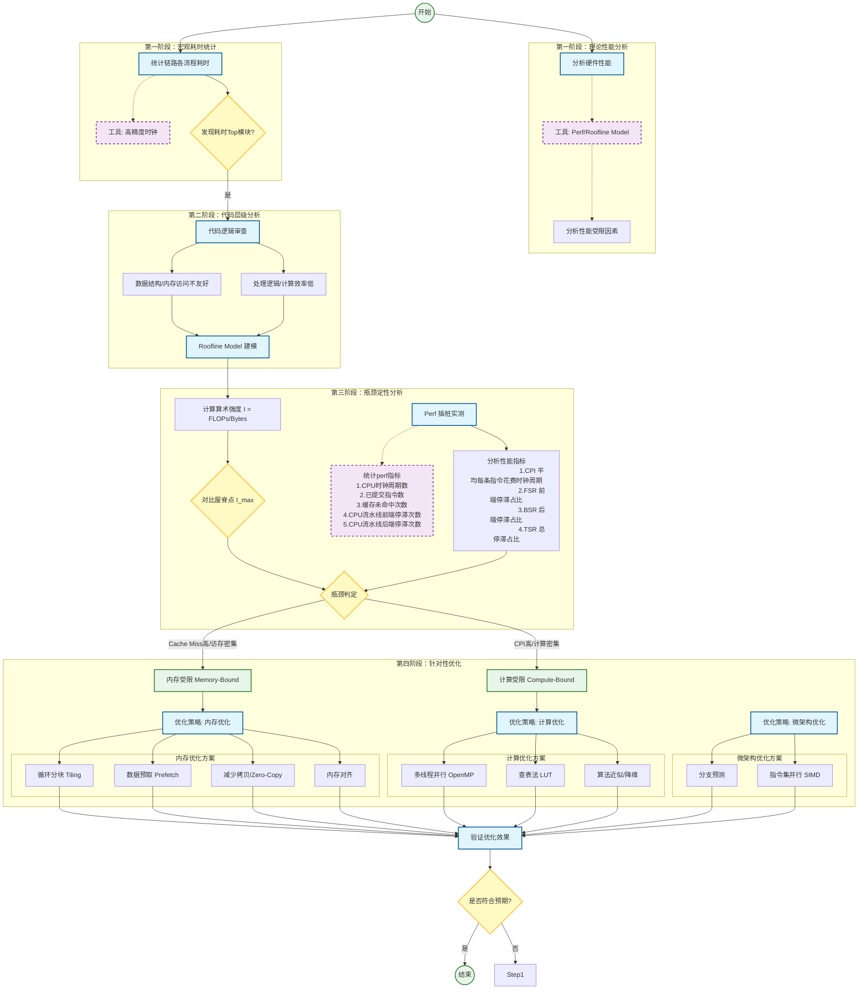

```mermaid
flowchart TD
    %% 定义节点样式
    classDef process fill:#e1f5fe,stroke:#01579b,stroke-width:2px;
    classDef decision fill:#fff9c4,stroke:#fbc02d,stroke-width:2px;
    classDef terminal fill:#e8f5e9,stroke:#2e7d32,stroke-width:2px;
    classDef tool fill:#f3e5f5,stroke:#7b1fa2,stroke-width:2px,stroke-dasharray: 5 5;

    Start((开始)):::terminal --> Step1_1
    subgraph Phase1_1 [第一阶段：理论性能分析]
        Step1_1[分析硬件性能]:::process
        Tool1_1[工具: Perf/Roofline Model]:::tool
        Check1_1[分析性能受限因素]
        Step1_1 -.-> Tool1_1
        Tool1_1 -.-> Check1_1
        
    end

    Start((开始)):::terminal --> Step1_0
    
    subgraph Phase1_0 [第一阶段：宏观耗时统计]
        Step1_0[统计链路各流程耗时]:::process
        Tool1_0[工具: 高精度时钟]:::tool
        Step1_0 -.-> Tool1_0
        Step1_0 --> Result1{发现耗时Top模块?}:::decision
    end

    Result1 -- 是 --> Step2
    
    subgraph Phase2 [第二阶段：代码层级分析]
        Step2[代码逻辑审查]:::process
        Check1[数据结构/内存访问不友好]
        Check2[处理逻辑/计算效率低]
        Step2 --> Check1 & Check2
        Check1 & Check2 ---> Step3
    end
    
    subgraph Phase3 [第三阶段：瓶颈定性分析]
        Step3[Roofline Model 建模]:::process
        Step3 --> CalcIntensity[计算算术强度 I = FLOPs/Bytes]
        CalcIntensity --> Compare{对比屋脊点 I_max}:::decision
        
        Step4[Perf 插桩实测]:::process
        Tool4[统计perf指标
            1.CPU时钟周期数 
              2.已提交指令数
              3.缓存未命中次数 
              4.CPU流水线前端停滞次数
              5.CPU流水线后端停滞次数]:::tool
        Step4 -.-> Tool4
        Step4 --> PerfData[分析性能指标
                            1.CPI 平均每条指令花费时钟周期
                            2.FSR 前端停滞占比
                            3.BSR 后端停滞占比
                            4.TSR 总停滞占比]
        
        Compare & PerfData --> Analysis{瓶颈判定}:::decision
    end

    Analysis -- Cache Miss高/访存密集 --> MemBound[内存受限 Memory-Bound]:::terminal
    Analysis -- CPI高/计算密集 --> CompBound[计算受限 Compute-Bound]:::terminal

    subgraph Phase4 [第四阶段：针对性优化]
        OptMem[优化策略: 内存优化]:::process
        OptComp[优化策略: 计算优化]:::process
        OptArch[优化策略: 微架构优化]:::process
        
        MemBound --> OptMem
        CompBound --> OptComp

        subgraph MemStrat [内存优化方案]
            M1[循环分块 Tiling]
            M2[数据预取 Prefetch]
            M3[减少拷贝/Zero-Copy]
            M4[内存对齐]
        end

        subgraph CompStrat [计算优化方案]
            C1[多线程并行 OpenMP]
            C2[查表法 LUT]
            C3[算法近似/降维]
        end

        subgraph MiArchStrat [微架构优化方案]
            A1[分支预测]
            A2[指令集并行 SIMD]
        end
        
        OptMem --> M1 & M2 & M3 & M4
        OptComp --> C1 & C2 & C3
        OptArch --> A1 & A2 
    end

    M1 & M2 & M3 & M4 --> Verify
    C1 & C2 & C3 --> Verify
    A1 & A2 --> Verify
    
    Verify[验证优化效果]:::process --> EndCheck{是否符合预期?}:::decision
    EndCheck -- 是 --> End((结束)):::terminal
    EndCheck -- 否 --> Step1
```

