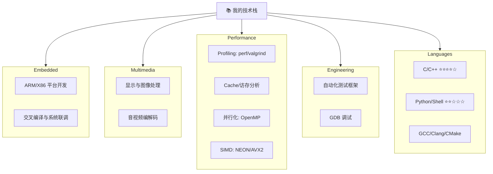

# 我的技能树

```mermaid
flowchart TD
    Root[📚 我的技术栈]

    Root --> Embedded[嵌入式 Linux ⭐⭐⭐⭐☆]
    Root --> Multimedia[多媒体/图像链路 ⭐⭐⭐⭐☆]
    Root --> Performance[性能优化 ⭐⭐⭐⭐☆]
    Root --> Engineering[工程化与质量 ⭐⭐⭐☆☆]
    Root --> Languages[编程语言与工具 ⭐⭐⭐⭐☆]

    subgraph Embedded
        direction LR
        Embedded_ARM_X86[ARM/X86 平台开发]
        Embedded_System[交叉编译与系统联调]
    end

    subgraph Multimedia
        direction LR
        Multimedia_Display[显示与图像处理]
        Multimedia_AV[音视频编解码]
    end

    subgraph Performance
        direction LR
        Perf_Profiling[Profiling: perf/valgrind]
        Perf_Cache[Cache/访存分析]
        Perf_Parallel[并行化: OpenMP]
        Perf_SIMD[SIMD: NEON/AVX2]
    end

    subgraph Engineering
        direction LR
        Eng_Test[自动化测试框架]
        Eng_Debug[GDB 调试]
    end

    subgraph Languages
        direction LR
        Lang_CPP[C/C++ ⭐⭐⭐⭐☆]
        Lang_Python[Python/Shell ⭐⭐☆☆☆]
        Lang_Tools[GCC/Clang/CMake]
    end
```
